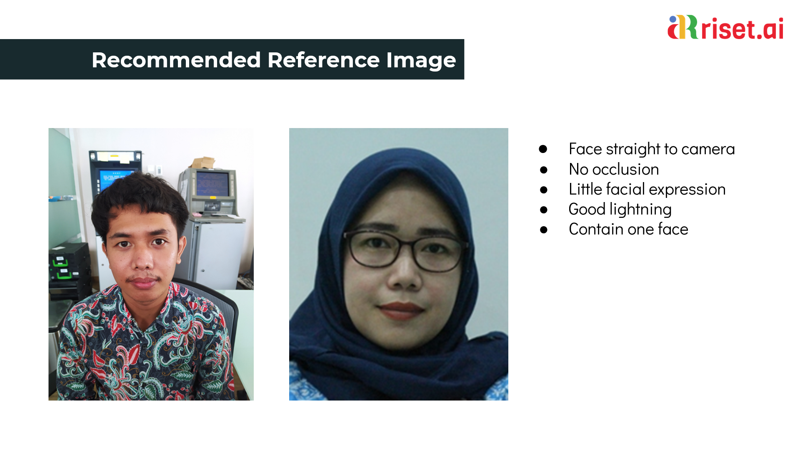

# Reference Image Requirements

To provide more accuracy and precision of facial comparison results, we recommend that you use the following guidelines when choosing **reference photos for registration**.

* Use an image of a face with a straight-on camera.
* Use an image of a face with both eyes open and visible.
* The image should contain the full head and shoulders of the person.
* Avoid items that block the face, such as masks, headbands.
* Use color images.
* Use images of faces with neutral facial expressions with mouth closed and little to no smile.
* Use images with flat lighting on the face.
* Use images that are bright and sharp.
* Use images that have sufficient contrast with the background. A high-contrast monochrome background works well.
* The minimum face resolution is 150 x 150 pixels. Higher-resolution images require a larger minimum face size.
* Format image: JPG \(JPEG\) and PNG.

