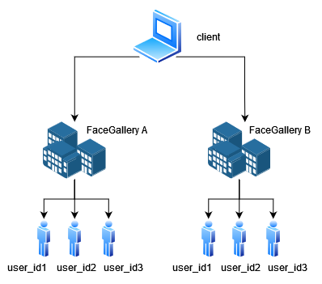

# Getting Started

## 1. Get client\_id and password

Fell free to contact Person in Chare in [here ](others/contat-person.md)to get new `client_id` and `password` .

## 2. Get Accestoken

Get `Acccestoken` to be able to hit API, please refer to this [API](authtenant.md#1-post-client-login) to get the `Accestoken`.

## 3. Take a Peek in Topology of API

The following is a generic top-level view of the system. You are the client.

* **Client** is the admin or the owner of several FaceGallery. The lient is your program (application) that is accessing our API. The client may have access to multiple FaceGallery.
* **FaceGallery** is a collection of users from a place or area. Think of it as a “database”.
* **User** is the person who uses the API for recognition. User will give their **face** (to be exact) in the database.

## 3. Create New Facegallery

FaceGallery is a collection of users, please refer to this [API ](apis/face-api.md#post-facegallery-create-facegallery)to make a new Facegallery.

## 4. Play with the API

Try to [enroll ](apis/face-api.md#post-facegallery-enroll-face)a user and then try [recognition ](apis/face-api.md#post-facegallery-recognize-face)and [verification](apis/face-api.md#post-facegallery-verify-face).

## 5. Still in trouble?

Look at [the tutorial for hitting API with Postman](others/postman-setting.md) or the [contact ](others/contat-person.md)person in charge.

