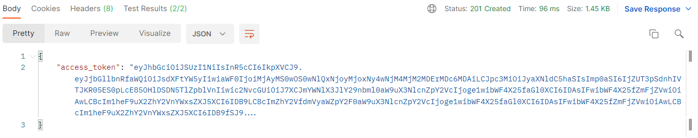
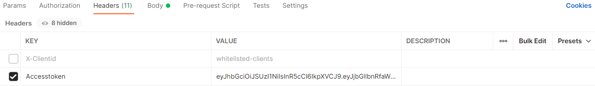
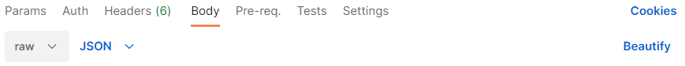
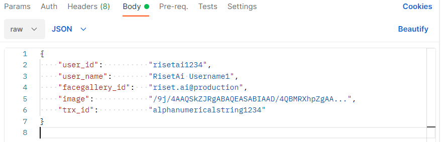
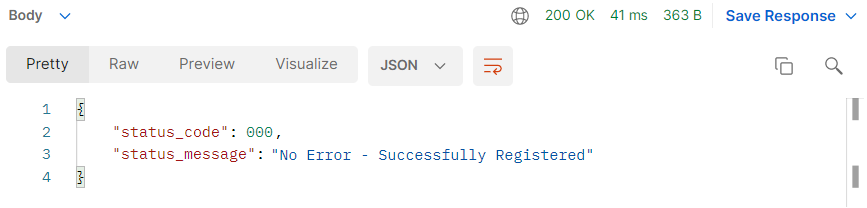

# Tutorial for Hitting API with Postman

## Steps

1. Get the `Accesstoken`.
2. Choose POST, GET or DELETE method.
3. Fill in the URL according to the API you want to do.
4. Choose Header.
5. Choose Body.
6. Choose raw.
7. Change type to JSON.
8. Fill with request JSON text.
9. Click send.
10. Wait for the response.

####  

## Example

1.Get `access_token` from [AuthTenant](../authtenant.md#1-post-client-login). Copy the `access_token` value.

2. Set the method and put the URL. \(e.g **POST**`/pedulilindungi/enroll-face`\) 

3. Choose Header, and add the `Accesstoken`. 

4. Choose Body and select RAW, change type file to JSON. 

5. Fill with request JSON text on the body like explained above. 

6. Click `Send` \(pictures number 2\).

7. Wait for the response. If it is successful, there’s will be output in JSON File.

8. The response output depends on which requests are used.

